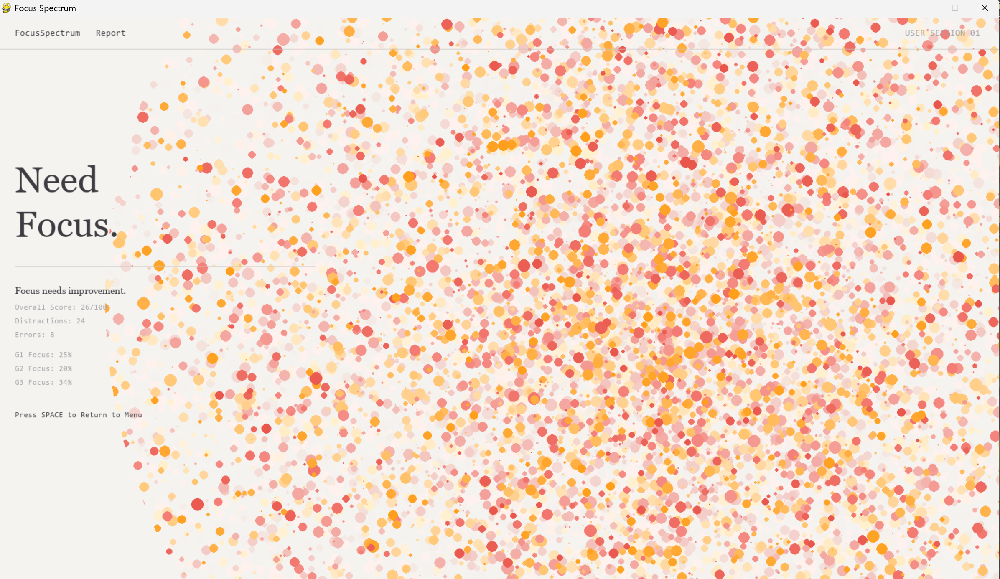

# FocusSpectrum

FocusSpectrum is an interactive game designed to visualize concentration levels using eye tracking and generative art. It aims to raise awareness and encourage self-reflection regarding the constant battle for attention in our modern lives. The game mechanism is inspired by real medical focus testing based on our [research](https://docs.google.com/document/d/1-tFaETexXhh5onA9BLmKabC6SyuwlL7R1RCDhAV5Eyg/edit?tab=t.sz0rl6tlcu9d). As the game proceeds, there will be random distraction jumping out, like sound, constant visual chaos, and notification and jiggling minions.

**Created by:** Xie Jinying, Sit Mei Lam, Zhang Danyi, Wang Yiwen

## Sample Video
[](https://www.youtube.com/watch?v=IymcM-q5NwA)

## 🚀 Installation & Setup

### Prerequisites
- Python 3.8 or higher
- A webcam (for eye tracking)

### Installation
1. Clone or download this repository.
2. Open a terminal in the project folder.
3. Install the required dependencies:
   ```bash
   pip install -r requirements.txt
   ```

### Running the Application
To start the application, run the main framework script:
```bash
python BackEnd/framework.py
```

## 🎮 How to Play

1. **Main Menu**: Upon launching, you will see the main menu.
2. **Calibration**: Click the "Calibration" button. Follow the red dot with your eyes to calibrate the eye tracker. This ensures accurate detection of your focus.
3. **Play Games**: There are three distinct mini-games designed to test different aspects of your focus. You must complete all three to generate your final report.
   - **Plant (Mei Lam)**: A focus endurance test. Keep your gaze steady to help the flowers bloom.
   - **Park (Yiwen)**: A dynamic tracking test. Follow the moving targets amidst distractions.
   - **Text (Danyi)**: A reading concentration test. Read the text while avoiding visual interruptions.
4. **View Report**: After completing all games, a "Report" button will appear. Click it to see your personalized "Focus Spectrum" artwork, generated based on your performance data.
   - **Sample Report**: You can also view a sample report from the main menu to see what the output looks like.

## 🎨 Concept & Ideation
After choosing a few random words based on the mechanism of SGDs game and a couple of twists and discussion, we decided to combine artistic visuals with practical utility. In our discussion, we reflected on the sheer number of distractions we face daily and decided to gamify this experience.

The application uses your eye movement data—specifically how well you can maintain focus on targets versus getting distracted—to generate a unique piece of abstract art. This art serves as a visual metaphor for your state of mind.

## 🛠️ Technical Details
- **Language**: Python
- **Framework**: Pygame (for rendering and game loop)
- **Computer Vision**: OpenCV & MediaPipe (for real-time face and eye tracking)
- **Generative Art**: Perlin Noise (for organic report visualization)

## 🔮 Future Steps
1. **Calibration Refinement**: While the current gaze tracking is functional and very precise for some part of the game, we aim to implement a more robust calibration system that adapts to different screen sizes and user distances automatically.
2. **More user testing**: we would love to have others to play around with our games and give feedback if possible!
3. **More accurate score**: currently, only game 1 achieve its ideal state of distraction tracking. Also, since all three games track distraction differently due to technical difficulties, the final report score is not strictly reflecting player's focus rate. Therefore, we have sample report to display how our report would be like in different focus spectrum.

## 📚 References
- [Gaze Tracking Library](https://github.com/antoinelame/GazeTracking)
- [Past IME student project](https://www.xiaohongshu.com/explore/674d827b000000000703905a)